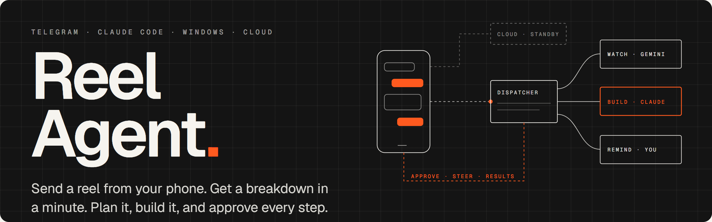
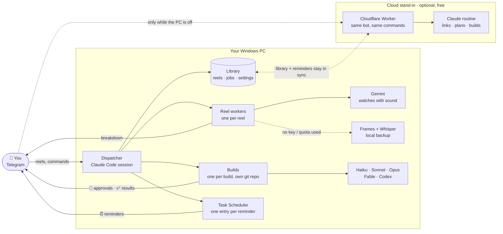
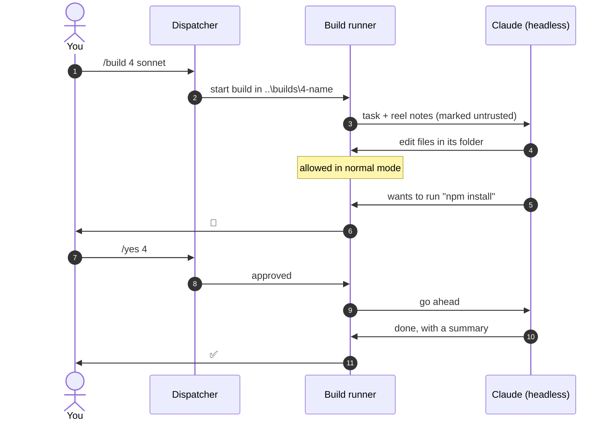
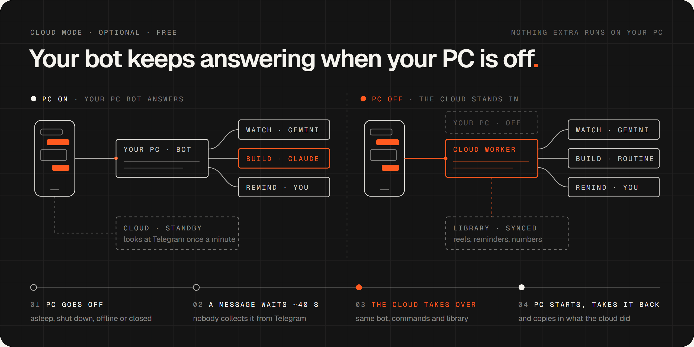
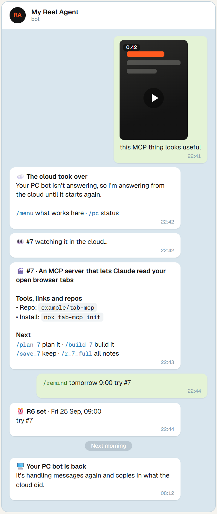
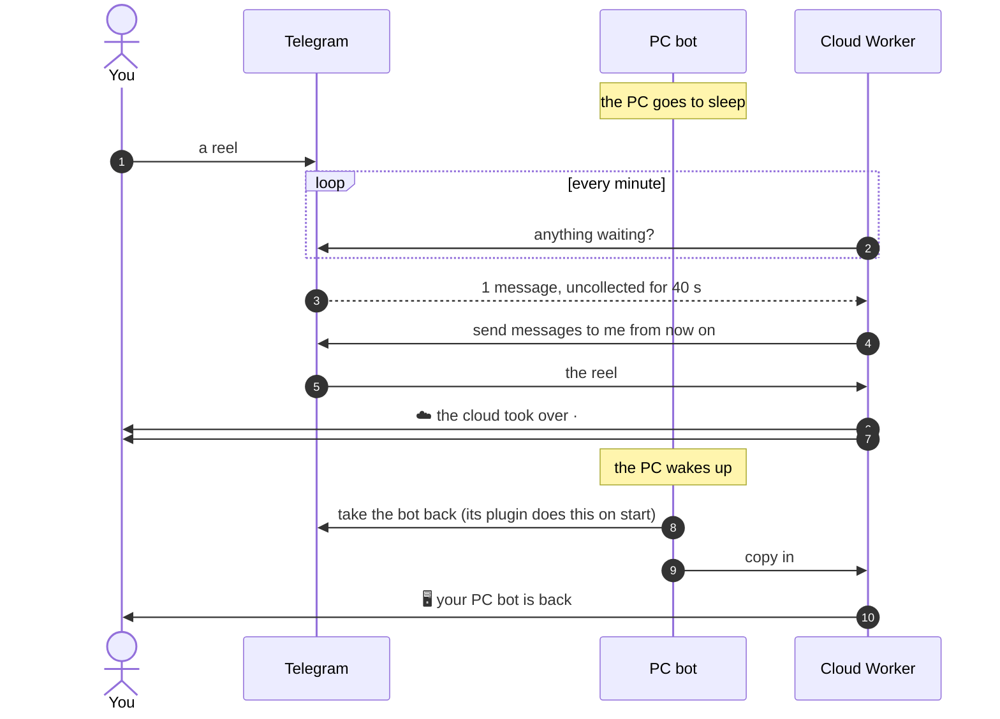

<p align="center">
  
</p>

<p align="center">
  
  
  
  
  
  
</p>

<p align="center">
  <a href="#quick-start">Quick start</a> ·
  <a href="#how-it-works">How it works</a> ·
  <a href="#when-your-pc-is-off">When your PC is off</a> ·
  <a href="#commands">Commands</a> ·
  <a href="docs/Reel%20Agent%20Setup%20Guide.pdf">Setup guide (PDF)</a> ·
  <a href="#privacy-and-safety">Privacy</a> ·
  <a href="#faq">FAQ</a> ·
  <a href="https://hnf-frn.github.io/Reel-watcher-telegram-Agent/">Website</a>
</p>

---

> **Saw an AI tool in a reel and thought "I should set that up"?** Forward the reel to your bot. It tells you what the video really shows, then builds it on your PC while you approve every step from your phone.

**Reel Agent** is a Telegram bot that runs on your own Windows PC. Send it an Instagram reel, a TikTok, a YouTube link or a screenshot. It watches the video, tells you exactly what it shows (the tools, links, repos and commands), and can plan and build it on your PC with the AI model you choose, asking you on your phone before it runs a single command. Turn the PC off and, if you set up the optional cloud stand-in, the same bot keeps answering from the cloud.

<table>
<tr>
<td width="46%" valign="top">

</td>
<td valign="top">

### What it does

- **Watches any reel.** Gemini watches the whole video with sound. No key or out of quota? A local backup watcher takes over (frames + Whisper).
- **Handles several at once.** Every reel gets a number (`#4`) and its own worker, so nothing blocks the next message.
- **Builds from your phone.** `/plan 4`, then `/build 4 sonnet`. Each build lives in its own git repository, so `/diff` and `/undo` always work.
- **Asks before every command.** You get the exact command and answer `/yes 4`, `/no 4 <reason>` or `/always 4`.
- **Lets you pick the model.** Haiku, Sonnet, Opus, Fable or Codex, per task or per build.
- **Reminds you.** `/remind tomorrow 9:00 …` is booked in Windows Task Scheduler and pings your phone on time, with nothing running in between.
- **Keeps going when your PC is off.** Optional and free: a Cloudflare Worker takes over the same bot within a minute or two, and hands it back when the PC starts. [How](#when-your-pc-is-off).
- **Shows what's left.** `/quota` reports Gemini calls left today and your Claude plan usage.

</td>
</tr>
</table>

## Quick start

**You need:** Windows 10 or 11, a [Claude](https://claude.ai) Pro or Max plan, and Telegram on your phone. The full walkthrough, with screenshots of every step, is in the **[setup guide (PDF)](docs/Reel%20Agent%20Setup%20Guide.pdf)**.

```powershell
winget install OpenJS.NodeJS.LTS     # skip if you have Node.js; then open a NEW PowerShell window
npx reel-agent
```

That one command does the rest, asking before each change:

1. **Tools:** installs Python, Git and Claude Code if they're missing, and signs you in to Claude.
2. **Download:** gets Reel Agent into `~/reel-agent` (or updates it).
3. **Guided setup:** your bot token from [@BotFather](https://t.me/BotFather) (`/newbot`), a Gemini key, packages, reminders and start-at-login.
4. **Start and pair:** starts the bot, waits for your first Telegram message and approves your account from the code the bot sends you.

Send `/menu` from your phone. That's it. Later, `npx reel-agent status`, `update` or `doctor` work from any terminal.

<details>
<summary>Prefer to do it by hand?</summary>

```powershell
winget install Python.Python.3.13 OpenJS.NodeJS.LTS Git.Git
irm https://claude.ai/install.ps1 | iex          # Claude Code; run `claude` once to sign in
git clone https://github.com/HNF-FRN/Reel-watcher-telegram-Agent.git reel-agent
cd reel-agent
.\setup                                           # guided setup
.\bot start                                       # a window opens; keep it open
```

Message your bot; it replies with a pairing code. In the bot window, type `/telegram:access pair <code>`, then `/telegram:access policy allowlist`.

</details>

> [!TIP]
> Add a free Gemini key from [Google AI Studio](https://aistudio.google.com/apikey) when setup asks for it. Breakdowns are much better with it: Gemini watches the whole video with sound.

### Just want Claude to watch videos? (Windows, macOS, Linux)

The video watcher also works on its own, as a Claude Code plugin: no Telegram bot and no Windows needed. In Claude Code:

```
/plugin marketplace add HNF-FRN/Reel-watcher-telegram-Agent
/plugin install reel-watch@reel-agent
```

On OpenClaw: `openclaw skills install @hnf-frn/reel-watch` ([ClawHub](https://clawhub.ai/hnf-frn/skills/reel-watch)). Straight from a terminal, on any OS: `npx reel-agent watch <link>` prints Gemini's breakdown.

Then `pip install yt-dlp imageio-ffmpeg` (plus `faster-whisper` for transcripts without Gemini), set `GEMINI_API_KEY` if you have one, and paste any reel, TikTok, YouTube or X link into Claude Code: *"what does this video show?"* Everything it saves goes to `reels/` in the current folder.

## How it works

One **dispatcher** (a Claude Code session with the Telegram channel) receives every message and immediately hands the work to a background worker, so it's always free for the next one. If you add the cloud stand-in, it waits in the background and only takes the bot while the PC can't.



### Building, with you in the loop

Every build runs as its own headless Claude (or Codex) process in `..\builds\<N>-<name>\`. A small runner answers the build's permission prompts itself: file edits inside its own folder are allowed, and **every shell command is sent to your phone first**.



## When your PC is off

<p align="center">
  
</p>

Cloud mode is optional. It gives the same Telegram bot a stand-in on Cloudflare's free plan. **Nothing extra runs on your PC:** no heartbeat, no background process, no scheduled task. When a message sits uncollected for about 40 seconds (because the PC is asleep, shut down, offline, or the bot window is closed), the stand-in takes the bot and tells you so. When the PC bot starts again, it takes the bot back by itself and copies in everything the cloud did.

<table>
<tr>
<td width="40%" valign="top">

</td>
<td valign="top">

### What you get while the PC is off

- **Answered in the cloud, free:** videos, photos and YouTube links you send (watched by Gemini), plus `/jobs`, `/r`, `/find`, `/new`, `/save`, `/remind`, `/todo`, `/reminders`, `/done`, `/snooze` and `/pc`.
- **One Claude routine run each:** Instagram and TikTok links, `/plan`, `/build` (approve with `/yes N`), and plain-text requests. Routines use your Claude plan and have a daily cap.
- **Waits for the PC:** `/tell`, `/diff`, `/deploy`, `/quota` and settings. The bot says so instead of spending a run.

**One library.** Reel and reminder numbers carry on from the PC's, so `/r 3` means the same reel on either side.

**Reminders go out once.** The PC sends them as usual; if it's off at that moment, the cloud sends them.

**Builds stay private.** A cloud build can't touch a switched-off PC, so it pushes a branch and a draft pull request to a private repository of yours.

</td>
</tr>
</table>

The handover, step by step:



**Set it up** once you have the bot running on the PC (about 20 minutes). You need a free Cloudflare account (no card) and a Claude Pro or Max plan with routines. Full steps: **[cloud/README.md](cloud/README.md)**, or chapter 10 of the [setup guide](docs/Reel%20Agent%20Setup%20Guide.pdf).

```powershell
cd cloud; npm install; npx wrangler login     # 1. deploy the Worker and its database (see cloud/README.md)
# 2. create the Claude routine from cloud/ROUTINE.md
python cloud\pc_link.py setup https://reel-agent-telegram.<you>.workers.dev   # 3. connect the PC
```

## Commands

Type **`/`** in the chat for the menu, or send `/manual` for the full manual. Plain words work too: *"build 4 with opus"*, *"what's running?"*.

| Reels | Builds | Status & settings |
|---|---|---|
| *send a link or video* → breakdown | `/plan N [model]`: a plan, no changes | `/tasks` · `/pending` |
| `/jobs` · `/find words` · `/r N` | `/build N [model] [safe]` | `/quota`: Gemini + Claude left |
| `/save N` · `/dismiss N` | `/yes N` · `/no N why` · `/always N` | `/models` · `/model build opus` |
| `/new <idea>`: build without a reel | `/tell N <message>`: steer it | `/mode safe` · `/limit 45` |
| `/retry N` · `/rewatch N deep` | `/diff N` · `/undo N` · `/deploy N` | `/remind` · `/todo` · `/reminders` |

With cloud mode: `/pc` says whether the PC or the cloud has the bot, and `/failover off` (or `on`) stops or allows the takeover.

At the PC, from the project folder:

| Command | Does |
|---|---|
| `.\bot status` | Running? One Telegram connection, owned by the bot? What's building? |
| `.\bot start` · `.\bot stop` · `.\bot restart` | Open, close or reload the bot |
| `.\bot fix` | Remove extra Telegram connections (the usual cause of a silent bot) |
| `.\bot update` | Update the video downloader and Claude Code |
| `.\setup --check` | Re-check the whole setup without changing anything |
| `python cloud\pc_link.py status` | Cloud mode: who has the bot, what's running in the cloud |

## Configuration

| What | Where | Default |
|---|---|---|
| Gemini key | `.env` (created by setup, never committed) | none: local backup watcher |
| Model per task | `/model <watch\|research\|plan\|build> <model>` | Sonnet · Haiku · Opus · Sonnet |
| Build mode | `/mode safe\|normal` | normal: edits freely in its folder, asks before commands |
| Build time limit | `/limit <minutes>` | 60 (time spent waiting for you doesn't count) |
| Bot behaviour | `CLAUDE.md` (plain English), then `.\bot restart` | |
| Cloud mode | [`cloud/README.md`](cloud/README.md); `/failover on\|off` | off until set up |

## Project layout

```
reel-agent/
├─ setup.cmd · setup.py        guided setup
├─ bot.cmd · bot.ps1           start / stop / status / fix / update
├─ start.ps1                   the bot (auto-restarts if Claude exits)
├─ install-autostart.ps1       start at login + Sunday digest
├─ CLAUDE.md                   how the dispatcher behaves
├─ MANUAL.md                   every command (sent on /manual)
├─ .claude/
│  ├─ agents/reel-worker.md    watches one reel
│  ├─ skills/reel-watch/       reel.py · jobs.py · build.py · runner.py · maintain.py
│  ├─ settings.json            what runs without asking
│  └─ bot-settings.json        Telegram plugin on, for the bot only
├─ reminders/remind.py         shared reminder list (Task Scheduler)
├─ cloud/                      optional stand-in: Worker, routine prompt, PC sync (pc_link.py), tests
└─ docs/                       setup guide (PDF + source), README images (+ source)
```

Your own data (`.env`, `reels/`, reminder lists) is created on first use and ignored by git.

## Privacy and safety

- **Reel content is never obeyed.** Videos, captions, transcripts and Gemini's notes are treated as information only. Builds receive them as reference material explicitly marked untrusted. Only your own Telegram messages give instructions.
- **Only you can use it.** The bot answers the one Telegram account you pair; strangers get no reply. The cloud stand-in checks the same account.
- **No command runs without your yes.** There is deliberately no mode that runs shell commands unattended. `/always N` allows one command word for one build. Cloud builds ask the same way.
- **Builds stay in their folder.** Writing elsewhere asks you first; installing elsewhere needs `/deploy N` plus a confirmation. Every build is a git repo you can diff and undo.
- **Your secrets stay yours.** The bot token lives in your user profile, the Gemini key in `.env`; git ignores both, and the bot itself is blocked from reading them. With cloud mode, their copies live in your Cloudflare account's encrypted secrets, and the Claude routine never sees them.
- **Where data goes:** videos go to Google Gemini if you add a key (free-tier data may be used by Google to improve its products), otherwise they're processed locally. Plans and builds go through your own Claude account. With cloud mode, a copy of your reel library and reminders is kept in your own Cloudflare database.

## Troubleshooting

| Symptom | Fix |
|---|---|
| Bot doesn't answer | `.\bot status`. If it says **PROBLEM**, run `.\bot fix`. Another Claude session had the Telegram plugin on. |
| First message gets no pairing code | `.\bot status` says **not connected** while the bot runs. Usually the token file had Windows line endings; `.\bot restart` fixes it. Full walkthrough: [docs/fix-no-pairing-code.md](docs/fix-no-pairing-code.md). |
| "running scripts is disabled" | Use `.\bot` and `.\setup`: they work regardless of the execution policy. |
| "I couldn't grab that one" | Save the video on your phone and send the file itself. `.\bot update` often helps too. |
| Breakdowns say "used the backup watcher" | Gemini's free quota is used up for today; `/quota` shows when it resets. |
| PC off and no answer after 3 minutes | Cloud mode isn't set up, or `/failover off` is on. With the PC back on, `python cloud\pc_link.py status`. |
| "Claude routine limit reached" | The cloud used today's routine runs. Cheap commands and video watching still work; the rest resets tomorrow. |

More in chapter 11 of the [setup guide](docs/Reel%20Agent%20Setup%20Guide.pdf).

## Updating

```powershell
git pull
.\bot update
.\bot restart
cd cloud; npm install; npm run deploy     # only if you use cloud mode
```

Your key, token, reels and reminders are never touched by an update.

## FAQ

**Is it free?** The code is (MIT). Watching uses Gemini's free tier, and cloud mode fits Cloudflare's free plan. Planning and building need a Claude Pro or Max plan, since they run through Claude Code; Codex builds use your OpenAI account instead.

**Does it work on Mac or Linux?** The video watcher does, [as a Claude Code plugin](#just-want-claude-to-watch-videos-windows-macos-linux). The full Telegram bot is Windows-only for now; the parts to port are listed in [#13](https://github.com/HNF-FRN/Reel-watcher-telegram-Agent/issues/13), and help is very welcome.

**Can a malicious reel take over my PC?** Reel content is treated as information, never as instructions, and no shell command runs without your `/yes`. See [Privacy and safety](#privacy-and-safety) and the [security policy](SECURITY.md).

**Do I need Gemini?** No. Without a key, a local watcher samples frames and transcribes the audio with Whisper. Gemini is better because it watches the whole video with sound.

**Which sites work?** Instagram, TikTok, YouTube (including Shorts) and screenshots are tested. Downloads go through `yt-dlp`, so many others probably work; [#14](https://github.com/HNF-FRN/Reel-watcher-telegram-Agent/issues/14) is checking which.

**Can I use it without building anything?** Yes. The library alone is useful: every tool and trick you scroll past, searchable with `/find`, `/saved` and `/tag`.

## Contributing

Start with a [`good first issue`](https://github.com/HNF-FRN/Reel-watcher-telegram-Agent/labels/good%20first%20issue) or the [macOS and Linux port](https://github.com/HNF-FRN/Reel-watcher-telegram-Agent/issues/13). [CONTRIBUTING.md](CONTRIBUTING.md) shows where everything lives and how to run the tests. Built something from a reel? Post it in [Show and tell](https://github.com/HNF-FRN/Reel-watcher-telegram-Agent/discussions/categories/show-and-tell).

## Support

If Reel Agent is useful to you, **a ⭐ on GitHub** is the best way to help other people find it. Bugs, ideas and questions are welcome in [Issues](https://github.com/HNF-FRN/Reel-watcher-telegram-Agent/issues) and [Discussions](https://github.com/HNF-FRN/Reel-watcher-telegram-Agent/discussions).

## License

[MIT](LICENSE). Free to use, change and share. Reel Agent is an independent project and is not affiliated with Anthropic, Google, Cloudflare or Telegram.
