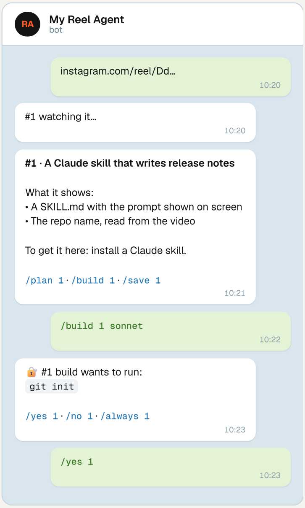
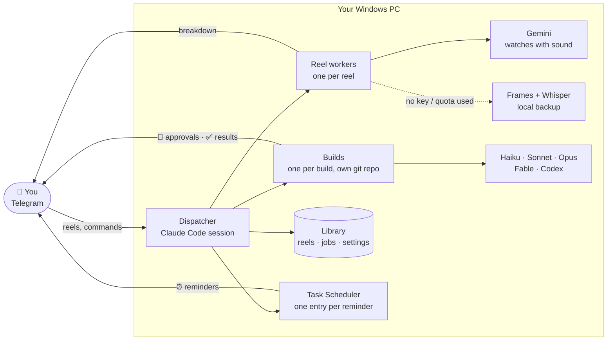
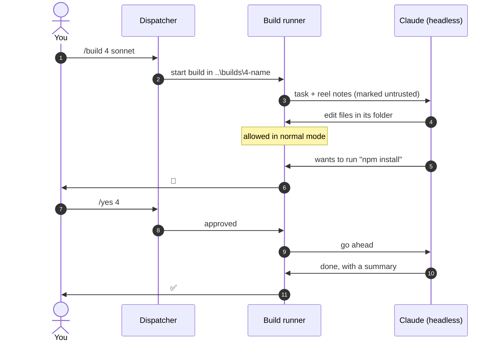

<p align="center">
  
</p>

<p align="center">
  
  
  
  
  
</p>

<p align="center">
  <a href="#quick-start">Quick start</a> ·
  <a href="#how-it-works">How it works</a> ·
  <a href="#commands">Commands</a> ·
  <a href="docs/Reel%20Agent%20Setup%20Guide.pdf">Setup guide (PDF)</a> ·
  <a href="#privacy-and-safety">Privacy</a>
</p>

---

**Reel Agent** is a Telegram bot that runs on your own Windows PC. Send it an Instagram reel, a TikTok, a YouTube link or a screenshot. It watches the video, tells you exactly what it shows (the tools, links, repos and commands), and can plan and build it on your PC with the AI model you choose, asking you on your phone before it runs a single command.

<table>
<tr>
<td width="46%" valign="top">

</td>
<td valign="top">

### What it does

- **Watches any reel.** Gemini watches the whole video with sound. No key or out of quota? A local backup watcher takes over (frames + Whisper).
- **Handles several at once.** Every reel gets a number (`#4`) and its own worker, so nothing blocks the next message.
- **Builds from your phone.** `/plan 4`, then `/build 4 sonnet`. Each build lives in its own git repository, so `/diff` and `/undo` always work.
- **Asks before every command.** You get the exact command and answer `/yes 4`, `/no 4 <reason>` or `/always 4`.
- **Lets you pick the model.** Haiku, Sonnet, Opus, Fable or Codex, per task or per build.
- **Reminds you.** `/remind tomorrow 9:00 …` is booked in Windows Task Scheduler and pings your phone on time, with nothing running in between.
- **Shows what's left.** `/quota` reports Gemini calls left today and your Claude plan usage.

</td>
</tr>
</table>

## Quick start

**You need:** Windows 10 or 11, a [Claude](https://claude.ai) Pro or Max plan, Telegram on your phone, and about 40 minutes. The full walkthrough, with screenshots of every step, is in the **[setup guide (PDF)](docs/Reel%20Agent%20Setup%20Guide.pdf)**.

```powershell
# 1. Basics (skip what you have), then open a NEW PowerShell window
winget install Python.Python.3.13 OpenJS.NodeJS.LTS Git.Git
irm https://claude.ai/install.ps1 | iex          # Claude Code; run `claude` once to sign in

# 2. Get the code
git clone https://github.com/HNF-FRN/Reel-watcher-telegram-Agent.git reel-agent
cd reel-agent

# 3. Guided setup: checks everything, asks before each change, saves your bot token and Gemini key
.\setup

# 4. Start the bot (a window opens; keep it open)
.\bot start
```

Then create your bot with [@BotFather](https://t.me/BotFather) (`/newbot`) if setup hasn't asked you for the token yet. Message your bot, and it replies with a pairing code. In the bot window, type:

```
/telegram:access pair <code>
/telegram:access policy allowlist
```

Send `/menu` from your phone. That's it.

> [!TIP]
> Add a free Gemini key from [Google AI Studio](https://aistudio.google.com/apikey) when setup asks for it. Breakdowns are much better with it: Gemini watches the whole video with sound.

## How it works

One **dispatcher** (a Claude Code session with the Telegram channel) receives every message and immediately hands the work to a background worker, so it's always free for the next one.



### Building, with you in the loop

Every build runs as its own headless Claude (or Codex) process in `..\builds\<N>-<name>\`. A small runner answers the build's permission prompts itself: file edits inside its own folder are allowed, and **every shell command is sent to your phone first**.



## Commands

Type **`/`** in the chat for the menu, or send `/manual` for the full manual. Plain words work too: *"build 4 with opus"*, *"what's running?"*.

| Reels | Builds | Status & settings |
|---|---|---|
| *send a link or video* → breakdown | `/plan N [model]`: a plan, no changes | `/tasks` · `/pending` |
| `/jobs` · `/find words` · `/r N` | `/build N [model] [safe]` | `/quota`: Gemini + Claude left |
| `/save N` · `/dismiss N` | `/yes N` · `/no N why` · `/always N` | `/models` · `/model build opus` |
| `/new <idea>`: build without a reel | `/tell N <message>`: steer it | `/mode safe` · `/limit 45` |
| `/retry N` · `/rewatch N deep` | `/diff N` · `/undo N` · `/deploy N` | `/remind` · `/todo` · `/reminders` |

At the PC, from the project folder:

| Command | Does |
|---|---|
| `.\bot status` | Running? One Telegram connection, owned by the bot? What's building? |
| `.\bot start` · `.\bot stop` · `.\bot restart` | Open, close or reload the bot |
| `.\bot fix` | Remove extra Telegram connections (the usual cause of a silent bot) |
| `.\bot update` | Update the video downloader and Claude Code |
| `.\setup --check` | Re-check the whole setup without changing anything |

## Configuration

| What | Where | Default |
|---|---|---|
| Gemini key | `.env` (created by setup, never committed) | none: local backup watcher |
| Model per task | `/model <watch\|research\|plan\|build> <model>` | Sonnet · Haiku · Opus · Sonnet |
| Build mode | `/mode safe\|normal` | normal: edits freely in its folder, asks before commands |
| Build time limit | `/limit <minutes>` | 60 (time spent waiting for you doesn't count) |
| Bot behaviour | `CLAUDE.md` (plain English), then `.\bot restart` | |

## Project layout

```
reel-agent/
├─ setup.cmd · setup.py        guided setup
├─ bot.cmd · bot.ps1           start / stop / status / fix / update
├─ start.ps1                   the bot (auto-restarts if Claude exits)
├─ install-autostart.ps1       start at login + Sunday digest
├─ CLAUDE.md                   how the dispatcher behaves
├─ MANUAL.md                   every command (sent on /manual)
├─ .claude/
│  ├─ agents/reel-worker.md    watches one reel
│  ├─ skills/reel-watch/       reel.py · jobs.py · build.py · runner.py · maintain.py
│  ├─ settings.json            what runs without asking
│  └─ bot-settings.json        Telegram plugin on, for the bot only
├─ reminders/remind.py         shared reminder list (Task Scheduler)
└─ docs/                       setup guide (PDF + source)
```

Your own data (`.env`, `reels/`, reminder lists) is created on first use and ignored by git.

## Privacy and safety

- **Reel content is never obeyed.** Videos, captions, transcripts and Gemini's notes are treated as information only. Builds receive them as reference material explicitly marked untrusted. Only your own Telegram messages give instructions.
- **Only you can use it.** The bot answers the one Telegram account you pair; strangers get no reply.
- **No command runs without your yes.** There is deliberately no mode that runs shell commands unattended. `/always N` allows one command word for one build.
- **Builds stay in their folder.** Writing elsewhere asks you first; installing elsewhere needs `/deploy N` plus a confirmation. Every build is a git repo you can diff and undo.
- **Your secrets stay on your PC.** The bot token lives in your user profile, the Gemini key in `.env`; git ignores both. The bot itself is blocked from reading them.
- **Where data goes:** videos go to Google Gemini if you add a key (free-tier data may be used by Google to improve its products), otherwise they're processed locally. Plans and builds go through your own Claude account.

## Troubleshooting

| Symptom | Fix |
|---|---|
| Bot doesn't answer | `.\bot status`. If it says **PROBLEM**, run `.\bot fix`. Another Claude session had the Telegram plugin on. |
| "running scripts is disabled" | Use `.\bot` and `.\setup`: they work regardless of the execution policy. |
| "I couldn't grab that one" | Save the video on your phone and send the file itself. `.\bot update` often helps too. |
| Breakdowns say "used the backup watcher" | Gemini's free quota is used up for today; `/quota` shows when it resets. |

More in chapter 10 of the [setup guide](docs/Reel%20Agent%20Setup%20Guide.pdf).

## Updating

```powershell
git pull
.\bot update
.\bot restart
```

Your key, token, reels and reminders are never touched by an update.
