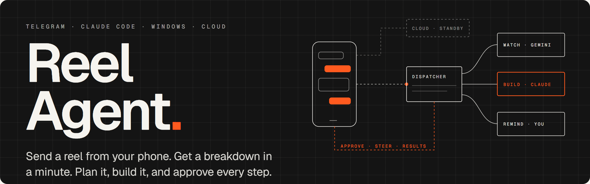
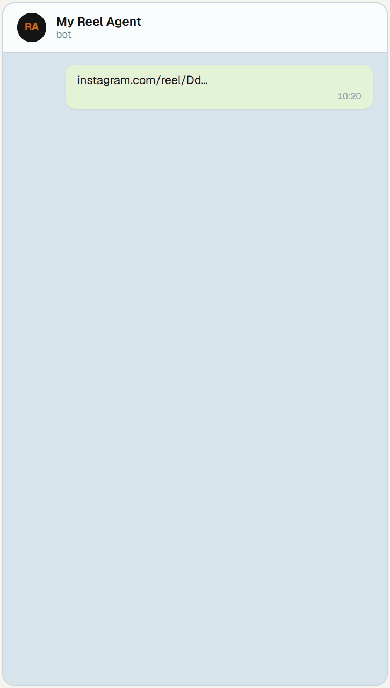
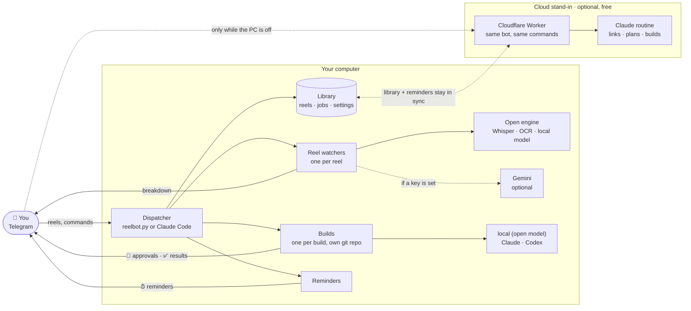
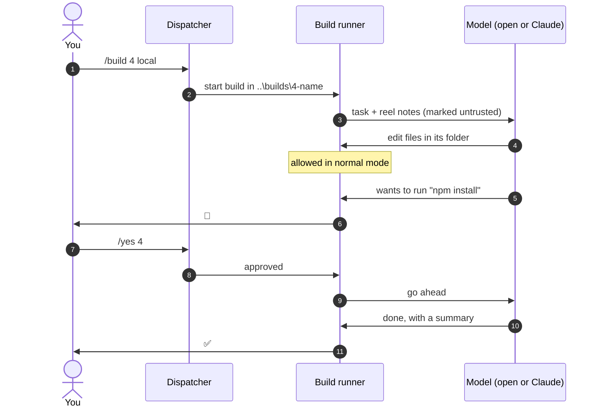
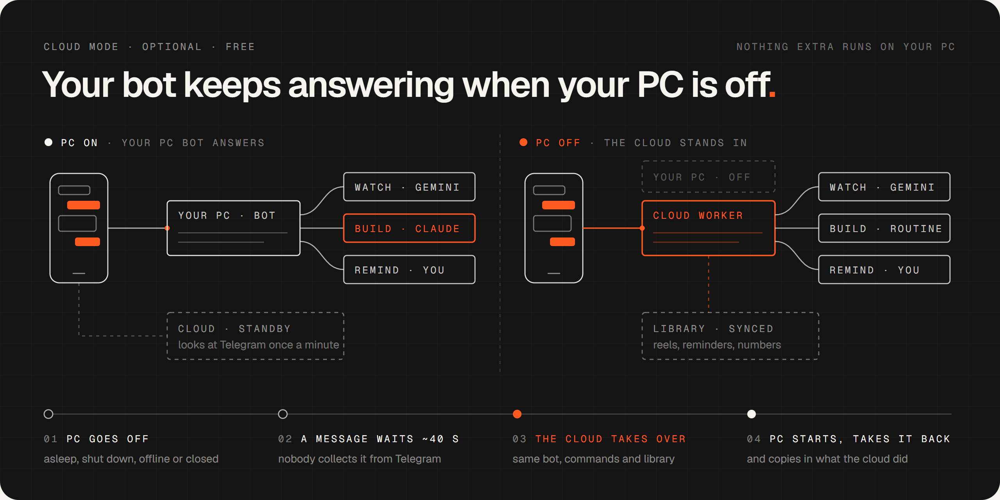
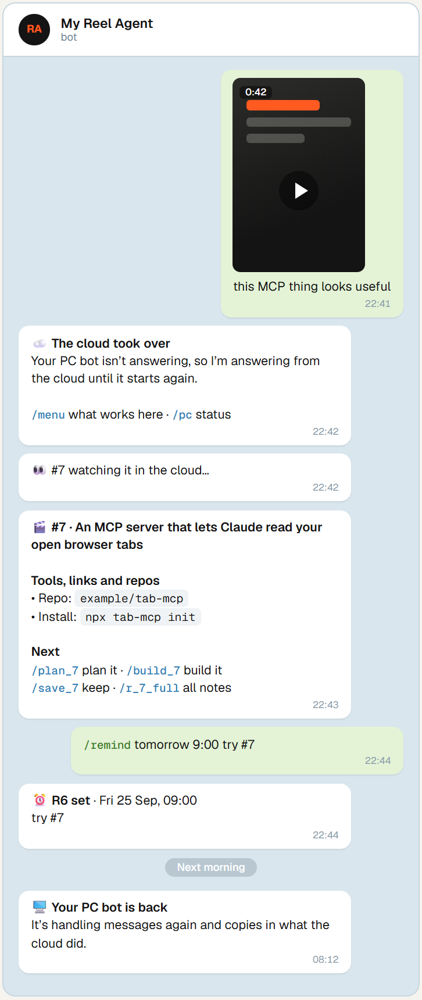
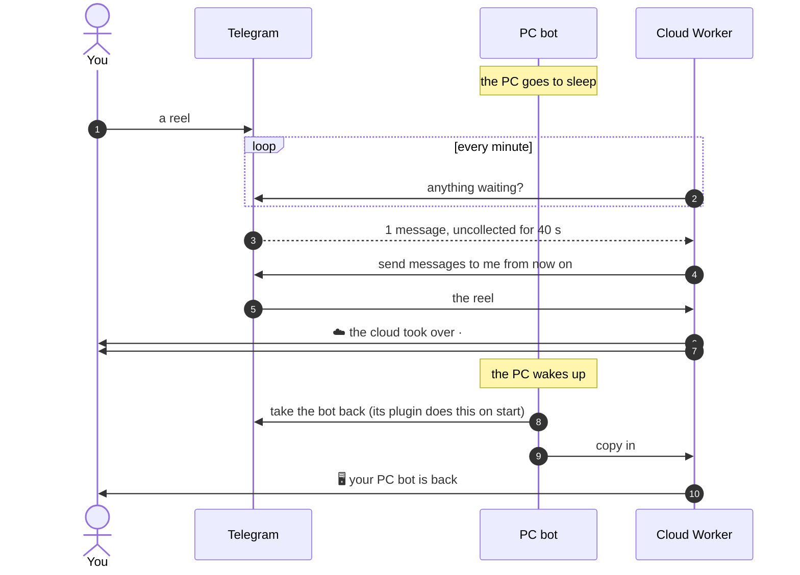

<p align="center">
  
</p>

<p align="center">
  <a href="https://github.com/HNF-FRN/Reel-watcher-telegram-Agent/actions/workflows/tests.yml"></a>
  
  
  
  
  
</p>

<p align="center">
  <a href="#quick-start">Quick start</a> ·
  <a href="#the-open-core">The open core</a> ·
  <a href="#how-it-works">How it works</a> ·
  <a href="#when-your-pc-is-off">When your PC is off</a> ·
  <a href="#commands">Commands</a> ·
  <a href="docs/Reel%20Agent%20Setup%20Guide.pdf">Setup guide (PDF)</a> ·
  <a href="#privacy-and-safety">Privacy</a> ·
  <a href="#faq">FAQ</a> ·
  <a href="https://hnf-frn.github.io/Reel-watcher-telegram-Agent/">Website</a>
</p>

<p align="center"><sub>Featured in <a href="https://github.com/slavakurilyak/awesome-ai-agents">awesome-ai-agents</a></sub></p>

---

> **Saw an AI tool in a reel and thought "I should set that up"?** Forward the reel to your bot. It tells you what the video really shows, then builds it on your PC while you approve every step from your phone.

**Reel Agent** is a Telegram bot that runs on your own computer. Send it an Instagram reel, a TikTok, a YouTube link or a screenshot. It watches the video, tells you exactly what it shows (the tools, links, repos and commands), and can plan and build it on your computer with the model you choose, asking you on your phone before it runs a single command.

It works entirely with open software: Whisper hears the video, OCR reads the screen, a local model (Ollama or any OpenAI-compatible server) writes the summary and does the plans and builds, and a plain Python bot routes your messages. No API key and no hosted AI service: apart from Telegram and fetching the video, everything happens on your machine. If you have them, Gemini, Claude Code and Codex plug in as options, and an optional cloud stand-in keeps the bot answering while your PC is off.

<table>
<tr>
<td width="46%" valign="top">

</td>
<td valign="top">

### What it does

- **Watches any reel, on your computer.** Whisper transcribes it, OCR reads every screen, and the exact commands, repos, packages and links are pulled out with where they appeared. A local model writes the summary. Optional: Gemini watches with sound.
- **Never invents a command.** Everything quoted comes from OCR and the transcript, not from a model, and risky commands (`curl … | sh`, `--dangerously-…`) are flagged.
- **Checks before you build.** `/deeper 4` looks up every repo and package the reel names on GitHub, npm and PyPI: real, maintained, licensed?
- **Builds from your phone.** `/plan 4`, then `/build 4 local`. Each build lives in its own git repository, so `/diff` and `/undo` always work.
- **Asks before every command.** You get the exact command and answer `/yes 4`, `/no 4 <reason>` or `/always 4`.
- **Lets you pick the model.** An open model on your computer (`local`), or Haiku, Sonnet, Opus, Fable or Codex, per task or per build.
- **Reminds you.** `/remind tomorrow 9:00 …` pings your phone on time.
- **Keeps going when your PC is off.** Optional and free: a Cloudflare Worker takes over the same bot within a minute or two, and hands it back when the PC starts. [How](#when-your-pc-is-off).

</td>
</tr>
</table>

## Quick start

### Open models, any OS

**You need:** Python 3.11+, Git, [Ollama](https://ollama.com) (or any OpenAI-compatible server: llama.cpp, LM Studio, vLLM) and Telegram on your phone. No Claude, no API key.

```bash
git clone https://github.com/HNF-FRN/Reel-watcher-telegram-Agent.git reel-agent && cd reel-agent
pip install -r requirements.txt -r requirements-open.txt   # video download, ffmpeg, Whisper, OCR
ollama pull qwen3:8b                                        # writes summaries, plans and builds
echo "TELEGRAM_BOT_TOKEN=<token from @BotFather>" >> .env   # on Windows, add this line to .env in an editor
python reelbot.py
```

Message your bot: it answers with a pairing code. Run `python reelbot.py pair <code>`, then send `/menu` and a reel. Plans and builds use the open model when Claude Code isn't installed (`/model build local` makes it the default anyway). A vision model such as `qwen2.5vl:7b` also looks at the frames when it writes the summary; settings are in [`.env.example`](.env.example).

### Windows, with Claude Code

**You need:** Windows 10 or 11, a [Claude](https://claude.ai) Pro or Max plan, and Telegram on your phone. Claude Code becomes the dispatcher (plain-English requests, research agents) and builds with Claude; everything above still works with it. The full walkthrough, with screenshots of every step, is in the **[setup guide (PDF)](docs/Reel%20Agent%20Setup%20Guide.pdf)**.

```powershell
winget install OpenJS.NodeJS.LTS     # skip if you have Node.js; then open a NEW PowerShell window
npx reel-agent
```

That one command does the rest, asking before each change:

1. **Tools:** installs Python, Git and Claude Code if they're missing, and signs you in to Claude.
2. **Download:** gets Reel Agent into `~/reel-agent` (or updates it).
3. **Guided setup:** your bot token from [@BotFather](https://t.me/BotFather) (`/newbot`), a Gemini key, packages, reminders and start-at-login.
4. **Start and pair:** starts the bot, waits for your first Telegram message and approves your account from the code the bot sends you.

Send `/menu` from your phone. That's it. Later, `npx reel-agent status`, `update` or `doctor` work from any terminal.

<details>
<summary>Prefer to do it by hand?</summary>

```powershell
winget install Python.Python.3.13 OpenJS.NodeJS.LTS Git.Git
irm https://claude.ai/install.ps1 | iex          # Claude Code; run `claude` once to sign in
git clone https://github.com/HNF-FRN/Reel-watcher-telegram-Agent.git reel-agent
cd reel-agent
.\setup                                           # guided setup
.\bot start                                       # a window opens; keep it open
```

Message your bot; it replies with a pairing code. In the bot window, type `/telegram:access pair <code>`, then `/telegram:access policy allowlist`.

</details>

> [!TIP]
> Optional: add a free Gemini key from [Google AI Studio](https://aistudio.google.com/apikey) when setup asks for it. Gemini then watches the whole video with sound, which helps with videos that show more than they say or write.

### Just the video watcher (Windows, macOS, Linux)

The watcher works on its own, without the bot. From a terminal:

```bash
pip install -r requirements.txt -r requirements-open.txt
python .claude/skills/reel-watch/scripts/reel.py "<reel, TikTok, YouTube or X link, or a video file>"
```

It prints the breakdown and saves it, with the frames and `manifest.json` (every link, repo and command with where it was seen), under `reels/`. `npx reel-agent watch <link>` does the same. In Claude Code it is also a plugin (`/plugin marketplace add HNF-FRN/Reel-watcher-telegram-Agent`, then `/plugin install reel-watch@reel-agent`), and on OpenClaw a skill (`openclaw skills install @hnf-frn/reel-watch`, [ClawHub](https://clawhub.ai/hnf-frn/skills/reel-watch)). Set `GEMINI_API_KEY` if you want Gemini to watch instead.

## The open core

Every step has an open path that runs on your computer; the closed services are optional add-ons.

| Step | Open, on your computer | Optional |
|---|---|---|
| Talk to you | [`reelbot.py`](.claude/skills/reel-watch/scripts/reelbot.py): Telegram long polling, fixed command routing, no model in the loop | A Claude Code session as dispatcher |
| Watch a video | [`reel.py`](.claude/skills/reel-watch/scripts/reel.py) + [`analyze.py`](.claude/skills/reel-watch/scripts/analyze.py): ffmpeg frames, faster-whisper, RapidOCR or Tesseract ([`ocr.py`](.claude/skills/reel-watch/scripts/ocr.py)) | Gemini watches with sound |
| Pull out what to act on | [`extract.py`](.claude/skills/reel-watch/scripts/extract.py): commands, repos, packages, MCP servers, links, gated offers, risky commands; no model, so nothing is invented | |
| Summarise | any OpenAI-compatible server ([`llm.py`](.claude/skills/reel-watch/scripts/llm.py)): Ollama, llama.cpp, LM Studio, vLLM | |
| Check what it names | [`verify.py`](.claude/skills/reel-watch/scripts/verify.py): GitHub, npm and PyPI public APIs | |
| Plan and build | [`agent.py`](.claude/skills/reel-watch/scripts/agent.py): a small tool-calling agent for open models, behind [`runner.py`](.claude/skills/reel-watch/scripts/runner.py)'s phone approvals | Claude Code, Codex |
| Remind | [`remind.py`](reminders/remind.py) | Windows Task Scheduler, cloud stand-in |

**Tested in public CI on every push** ([tests.yml](.github/workflows/tests.yml)):

- unit tests on Windows, macOS and Linux;
- the whole bot, end to end, against a fake Telegram and a fake model: pairing, a screenshot watched and answered with a card, a plan, and a build whose command waits for `/yes` from the "phone";
- the open engine on a generated video (on-screen commands, a voice-over), with Tesseract and with RapidOCR;
- the same with a real open-weight model on the runner's CPU (`qwen2.5:3b` through Ollama), which writes the summary and then builds and runs a script through the approval flow.

Each run uploads the breakdowns and the build log it produced, so you can read exactly what came out.

## How it works

One **dispatcher** receives every message and immediately hands the work to a background worker, so it's always free for the next one: `reelbot.py` (any OS, fixed rules) or a Claude Code session with the Telegram channel (Windows). If you add the cloud stand-in, it waits in the background and only takes the bot while the PC can't.


```mermaid
flowchart LR
    phone(["📱 You<br/>Telegram"])

    subgraph pc["Your computer"]
        direction LR
        bot["Dispatcher<br/>reelbot.py or Claude Code"]
        watch["Reel watchers<br/>one per reel"]
        build["Builds<br/>one per build, own git repo"]
        lib[("Library<br/>reels · jobs · settings")]
        rem["Reminders"]
        engine["Open engine<br/>Whisper · OCR · local model"]
        gem["Gemini<br/>optional"]
        models["local (open model)<br/>Claude · Codex"]

        bot --> watch
        bot --> build
        bot --> lib
        bot --> rem
        watch --> engine
        watch -. "if a key is set" .-> gem
        build --> models
    end

    subgraph cloud["Cloud stand-in · optional, free"]
        direction LR
        worker["Cloudflare Worker<br/>same bot, same commands"]
        routine["Claude routine<br/>links · plans · builds"]
        worker --> routine
    end

    phone -- "reels, commands" --> bot
    watch -- "breakdown" --> phone
    build -- "🔐 approvals · ✅ results" --> phone
    rem -- "⏰ reminders" --> phone
    phone -. "only while the PC is off" .-> worker
    lib <-. "library + reminders stay in sync" .-> worker
```

### Building, with you in the loop

Every build runs as its own process in `../builds/<N>-<name>/`: an open model driven by [`agent.py`](.claude/skills/reel-watch/scripts/agent.py), or headless Claude or Codex. A small runner answers the build's permission prompts itself: file edits inside its own folder are allowed (never its `.git` or approval files), and **every shell command is sent to your phone first**. The open-model agent can't read or write outside the build folder at all.


```mermaid
sequenceDiagram
    autonumber
    actor You
    participant Bot as Dispatcher
    participant Run as Build runner
    participant AI as Model (open or Claude)

    You->>Bot: /build 4 local
    Bot->>Run: start build in ..\builds\4-name
    Run->>AI: task + reel notes (marked untrusted)
    AI->>Run: edit files in its folder
    Note over Run: allowed in normal mode
    AI->>Run: wants to run "npm install"
    Run->>You: 🔐 #4 wants to run: npm install
    You->>Bot: /yes 4
    Bot->>Run: approved
    Run->>AI: go ahead
    AI->>Run: done, with a summary
    Run->>You: ✅ #4 build done · /diff 4 · /undo 4
```

## When your PC is off

<p align="center">
  
</p>

Cloud mode is optional, and made for the Claude Code bot (`reelbot.py` takes the bot back when it starts, but doesn't yet copy in what the cloud did). It gives the same Telegram bot a stand-in on Cloudflare's free plan. **Nothing extra runs on your PC:** no heartbeat, no background process, no scheduled task. When a message sits uncollected for about 40 seconds (because the PC is asleep, shut down, offline, or the bot window is closed), the stand-in takes the bot and tells you so. When the PC bot starts again, it takes the bot back by itself and copies in everything the cloud did.

<table>
<tr>
<td width="40%" valign="top">

</td>
<td valign="top">

### What you get while the PC is off

- **Answered in the cloud, free:** videos, photos and YouTube links you send (watched by Gemini), plus `/jobs`, `/r`, `/find`, `/new`, `/save`, `/remind`, `/todo`, `/reminders`, `/done`, `/snooze` and `/pc`.
- **One Claude routine run each:** Instagram and TikTok links, `/plan`, `/build` (approve with `/yes N`), and plain-text requests. Routines use your Claude plan and have a daily cap.
- **Waits for the PC:** `/tell`, `/diff`, `/deploy`, `/quota` and settings. The bot says so instead of spending a run.

**One library.** Reel and reminder numbers carry on from the PC's, so `/r 3` means the same reel on either side.

**Reminders go out once.** The PC sends them as usual; if it's off at that moment, the cloud sends them.

**Builds stay private.** A cloud build can't touch a switched-off PC, so it pushes a branch and a draft pull request to a private repository of yours.

</td>
</tr>
</table>

The handover, step by step:


```mermaid
sequenceDiagram
    autonumber
    actor You
    participant TG as Telegram
    participant PC as PC bot
    participant W as Cloud Worker

    Note over PC: the PC goes to sleep
    You->>TG: a reel
    loop every minute
        W->>TG: anything waiting?
    end
    TG-->>W: 1 message, uncollected for 40 s
    W->>TG: send messages to me from now on
    TG->>W: the reel
    W->>You: ☁️ the cloud took over · #7 watching it…
    W->>You: #7 🎬 breakdown
    Note over PC: the PC wakes up
    PC->>TG: take the bot back (its plugin does this on start)
    PC->>W: copy in #7 and any reminders
    W->>You: 🖥 your PC bot is back
```

**Set it up** once you have the bot running on the PC (about 20 minutes). You need a free Cloudflare account (no card) and a Claude Pro or Max plan with routines. Full steps: **[cloud/README.md](cloud/README.md)**, or chapter 10 of the [setup guide](docs/Reel%20Agent%20Setup%20Guide.pdf).

```powershell
cd cloud; npm install; npx wrangler login     # 1. deploy the Worker and its database (see cloud/README.md)
# 2. create the Claude routine from cloud/ROUTINE.md
python cloud\pc_link.py setup https://reel-agent-telegram.<you>.workers.dev   # 3. connect the PC
```

## Commands

Type **`/`** in the chat for the menu, or send `/manual` for the full manual. `4 make it a skill` plans reel #4 with your words as the brief; with the Claude Code dispatcher, any plain words work too: *"build 4 with opus"*, *"what's running?"*.

| Reels | Builds | Status & settings |
|---|---|---|
| *send a link or video* → breakdown | `/plan N [model]`: a plan, no changes | `/tasks` · `/pending` |
| `/jobs` · `/find words` · `/r N` | `/build N [model] [safe]` | `/quota`: local model, Gemini, Claude |
| `/deeper N`: is what it names real? | `/yes N` · `/no N why` · `/always N` | `/models` · `/model build local` |
| `/save N` · `/dismiss N` · `/new <idea>` | `/tell N <message>`: steer it | `/mode safe` · `/limit 45` |
| `/retry N` · `/rewatch N deep` | `/diff N` · `/undo N` · `/deploy N` | `/remind` · `/todo` · `/reminders` |

With cloud mode: `/pc` says whether the PC or the cloud has the bot, and `/failover off` (or `on`) stops or allows the takeover.

At the computer, from the project folder:

| Command | Does |
|---|---|
| `python reelbot.py` | Run the bot without Claude Code (any OS); `pair <code>` approves your account, `check` tests the token |
| `.\bot status` | Running? One Telegram connection, owned by the bot? What's building? |
| `.\bot start` · `.\bot stop` · `.\bot restart` | Open, close or reload the bot |
| `.\bot fix` | Remove extra Telegram connections (the usual cause of a silent bot) |
| `.\bot update` | Update the video downloader and Claude Code |
| `.\setup --check` | Re-check the whole setup without changing anything |
| `python cloud\pc_link.py status` | Cloud mode: who has the bot, what's running in the cloud |

## Configuration

| What | Where | Default |
|---|---|---|
| Local model server | `REEL_LLM_URL`, `REEL_LLM_MODEL` in `.env` ([`.env.example`](.env.example)) | Ollama on this computer; a vision model for summaries, a tool-calling one for builds |
| OCR | `REEL_OCR=rapidocr\|tesseract\|off` | whichever is installed |
| Gemini key | `.env` (never committed) | none: the open engine watches |
| Model per task | `/model <watch\|research\|plan\|build> <model>` | Sonnet · Haiku · Opus · Sonnet, or `local` for plans and builds when Claude Code isn't installed |
| Build mode | `/mode safe\|normal` | normal: edits freely in its folder, asks before commands |
| Build time limit | `/limit <minutes>` | 60 (time spent waiting for you doesn't count) |
| Bot behaviour | `CLAUDE.md` (plain English), then `.\bot restart` | |
| Cloud mode | [`cloud/README.md`](cloud/README.md); `/failover on\|off` | off until set up |

## Project layout

```
reel-agent/
├─ reelbot.py                  the bot without Claude Code (any OS)
├─ setup.cmd · setup.py        guided setup (Windows, Claude Code)
├─ bot.cmd · bot.ps1           start / stop / status / fix / update (Claude Code dispatcher)
├─ start.ps1                   the Claude Code bot (auto-restarts if Claude exits)
├─ install-autostart.ps1       start at login + Sunday digest
├─ CLAUDE.md                   how the Claude Code dispatcher behaves
├─ MANUAL.md                   every command (sent on /manual)
├─ .claude/
│  ├─ agents/reel-worker.md    watches one reel (Claude Code dispatcher)
│  ├─ skills/reel-watch/scripts/
│  │  ├─ reelbot.py            dispatcher: fixed routing, pairing, cards
│  │  ├─ reel.py · analyze.py  watch: download, frames, Whisper, OCR (ocr.py), breakdown
│  │  ├─ extract.py            commands, repos, packages and links found, with where
│  │  ├─ llm.py · agent.py     any OpenAI-compatible model; the open-model build agent
│  │  ├─ build.py · runner.py  plans and builds, phone approvals, git per build
│  │  ├─ verify.py             /deeper: GitHub, npm and PyPI checks
│  │  └─ jobs.py · maintain.py · tg.py · tgfmt.py · common.py
│  ├─ settings.json            what runs without asking
│  └─ bot-settings.json        Telegram plugin on, for the Claude Code bot only
├─ reminders/remind.py         shared reminder list
├─ cloud/                      optional stand-in: Worker, routine prompt, PC sync (pc_link.py), tests
├─ test_*.py                   tests (the open engine and model ones run in CI: .github/workflows/tests.yml)
└─ docs/                       setup guide (PDF + source), README images (+ source)
```

Your own data (`.env`, `reels/`, reminder lists) is created on first use and ignored by git.

## Privacy and safety

- **Reel content is never obeyed.** Videos, captions, transcripts and model notes are treated as information only. `reelbot.py` has no model in its loop at all, and builds receive reel notes as reference material explicitly marked untrusted. Only your own Telegram messages give instructions.
- **Nothing quoted is made up.** Commands, repos and links in a breakdown come from OCR and the transcript, never from a model, with where each was seen.
- **Only you can use it.** The bot answers the one Telegram account you pair, and strangers get no reply. Before you pair, a message gets a pairing code that does nothing until you approve it at the computer. The cloud stand-in checks the same account.
- **No command runs without your yes.** There is deliberately no mode that runs shell commands unattended. `/always N` allows one command word for one build. Cloud builds ask the same way.
- **Builds stay in their folder.** Writing elsewhere asks you first (the open-model agent can't reach outside its folder at all); installing elsewhere needs `/deploy N` plus a confirmation. No build can touch its own `.git` or approval files. Every build is a git repo you can diff and undo.
- **Your secrets stay yours.** The bot token lives in your user profile or `.env`, git ignores both, and the Claude Code bot is blocked from reading them. With cloud mode, their copies live in your Cloudflare account's encrypted secrets, and the Claude routine never sees them.
- **Where data goes:** with the open engine and a local model, videos, breakdowns, plans and builds stay on your computer. Videos go to Google Gemini only if you add a key (free-tier data may be used by Google to improve its products), and plans and builds go to Anthropic or OpenAI only if you pick Claude or Codex. `/deeper` asks GitHub, npm and PyPI about the names it checks. With cloud mode, a copy of your reel library and reminders is kept in your own Cloudflare database.

## Troubleshooting

| Symptom | Fix |
|---|---|
| Bot doesn't answer | `.\bot status`. If it says **PROBLEM**, run `.\bot fix`. Another Claude session had the Telegram plugin on. |
| First message gets no pairing code | `.\bot status` says **not connected** while the bot runs. Usually the token file had Windows line endings; `.\bot restart` fixes it. Full walkthrough: [docs/fix-no-pairing-code.md](docs/fix-no-pairing-code.md). |
| "running scripts is disabled" | Use `.\bot` and `.\setup`: they work regardless of the execution policy. |
| "I couldn't grab that one" | Save the video on your phone and send the file itself. `.\bot update` often helps too. |
| Breakdowns say Gemini's quota is used up | The open engine watched it instead; Gemini's free quota resets at midnight Pacific (`/quota`). |
| Breakdowns say "No model answered" | Start Ollama (`ollama serve`) with a model pulled, or set `REEL_LLM_URL` in `.env`. The breakdown is complete without one; only the summary is plainer. |
| A `local` build stops with "does not support tools" | That model can't call tools: pick one that can, e.g. `/build 4 local:qwen3:8b`, or set `REEL_LLM_MODEL`. |
| `reelbot.py` says another program is reading the bot | The Claude Code bot (or another `reelbot.py`) is running with the same token: stop one of them. |
| PC off and no answer after 3 minutes | Cloud mode isn't set up, or `/failover off` is on. With the PC back on, `python cloud\pc_link.py status`. |
| "Claude routine limit reached" | The cloud used today's routine runs. Cheap commands and video watching still work; the rest resets tomorrow. |

More in chapter 11 of the [setup guide](docs/Reel%20Agent%20Setup%20Guide.pdf).

## Updating

```bash
git pull
pip install -U -r requirements.txt -r requirements-open.txt    # then restart python reelbot.py
```

With the Claude Code bot on Windows:

```powershell
git pull
.\bot update
.\bot restart
cd cloud; npm install; npm run deploy     # only if you use cloud mode
```

Your key, token, reels and reminders are never touched by an update.

## FAQ

**Is it free?** Yes, with open models: the code is MIT and everything runs on your computer. Optional extras cost what they cost elsewhere: Gemini has a free tier, Claude Code needs a Claude Pro or Max plan, Codex uses your OpenAI account, and cloud mode fits Cloudflare's free plan.

**Does it work on Mac or Linux?** Yes: `python reelbot.py` runs the whole bot (watching, plans, builds with approvals, reminders) on any OS. The Claude Code dispatcher (`.\bot`, `setup.py`, autostart) is Windows-only for now; [#13](https://github.com/HNF-FRN/Reel-watcher-telegram-Agent/issues/13) tracks porting it.

**Which open models work?** Anything an OpenAI-compatible server serves. For builds the model has to call tools: `qwen3:8b` and bigger work well on a laptop, and CI runs a build with `qwen2.5:3b` on a plain CPU. A vision model (`qwen2.5vl:7b`, `gemma3`) also reads the frames for the summary.

**Can a malicious reel take over my PC?** Reel content is treated as information, never as instructions, and no shell command runs without your `/yes`. See [Privacy and safety](#privacy-and-safety) and the [security policy](SECURITY.md).

**Do I need Gemini?** No. The open engine transcribes the audio with Whisper, reads every screen with OCR and pulls out the exact commands and repos; a local model writes the summary. Gemini, if you add a key, watches the whole video with sound, which helps with videos that show more than they say or write.

**Which sites work?** Instagram, TikTok, YouTube (including Shorts) and screenshots are tested. Downloads go through `yt-dlp`, so many others probably work; [#14](https://github.com/HNF-FRN/Reel-watcher-telegram-Agent/issues/14) is checking which.

**Can I use it without building anything?** Yes. The library alone is useful: every tool and trick you scroll past, searchable with `/find`, `/saved` and `/tag`.

## Contributing

Start with a [`good first issue`](https://github.com/HNF-FRN/Reel-watcher-telegram-Agent/labels/good%20first%20issue) or the [macOS and Linux port](https://github.com/HNF-FRN/Reel-watcher-telegram-Agent/issues/13). [CONTRIBUTING.md](CONTRIBUTING.md) shows where everything lives and how to run the tests. Built something from a reel? Post it in [Show and tell](https://github.com/HNF-FRN/Reel-watcher-telegram-Agent/discussions/categories/show-and-tell).

## Support

If Reel Agent is useful to you, **a ⭐ on GitHub** is the best way to help other people find it. Bugs, ideas and questions are welcome in [Issues](https://github.com/HNF-FRN/Reel-watcher-telegram-Agent/issues) and [Discussions](https://github.com/HNF-FRN/Reel-watcher-telegram-Agent/discussions).

## License

[MIT](LICENSE). Free to use, change and share. Reel Agent is an independent project and is not affiliated with Anthropic, Google, Cloudflare or Telegram.
